# Claude Design-like Visual Generation Upgrade Spec

## Purpose

This spec defines the next visual-generation upgrade for `pptx-creator`: move from direct deck authoring to a design-artifact pipeline that plans, previews, reviews, repairs, and then compiles editable PPTX files.

The goal is not to clone Anthropic Claude Design internals. Public sources describe Claude Design as a design workspace that can use prompts, images, documents, codebases, design systems, comments, direct edits, artifacts, and export flows. Its internal source code and architecture are not public. This proposal uses those public ideas as product inspiration and maps them into the existing `pptx-creator` architecture.

Primary public references:

- Anthropic announcement: <https://www.anthropic.com/news/claude-design-anthropic-labs>
- Claude Design system setup: <https://support.claude.com/en/articles/14604397-set-up-your-design-system-in-claude-design>
- Claude artifacts: <https://support.claude.com/en/articles/9487310-what-are-artifacts-and-how-do-i-use-them>

## Success Criteria

- Text input can produce a richer deck plan before PPTX rendering.
- Each run can emit traceable design handoff artifacts, not only `deck.manifest.json`.
- Layouts vary across pages through explicit UI patterns and component specs.
- Complex slides such as architecture diagrams, process flows, dashboards, matrices, and roadshow pages compile into editable PPTX objects.
- HTML/CSS/React/data preview artifacts can be generated for visual inspection and iteration.
- Screenshot-level review can score rendered output and create bounded repair patches.
- Strict replica workflows still preserve source fidelity and do not use outside design inspiration to alter the source.

## Non-goals

- Do not build a full browser-based design editor in this phase.
- Do not make PPTX depend on raster screenshots as the primary output.
- Do not require a live LLM or vision model for the offline test suite.
- Do not replace existing `deck.manifest.json`; extend the upstream design pipeline that produces it.
- Do not submit files under `docs/`, because the repository currently ignores that directory by user preference.

## Current Foundation

The repository already has useful building blocks:

- `deck.storyboard.json`, `deck.design-direction.json`, and `slide-design-specs.json` for design-first generation.
- `layout-archetypes/` for semantic layout patterns.
- `scripts/lib/manifest-compiler.mjs` for compiling design specs into manifests.
- `scripts/lib/direction-explorer.mjs` for multi-direction exploration.
- `scripts/lib/visual-critic.mjs` and `scripts/lib/repair-patch.mjs` for deterministic visual review and bounded repairs.
- `scripts/lib/vision-review.mjs` for mock screenshot-level review.
- `workbench/` for a lightweight visual workbench shell.
- `schemas/source-registry.schema.json` and `schemas/asset-registry.schema.json` for traceability.

The upgrade should connect these pieces into a stronger artifact chain.

## Proposed Pipeline

```mermaid
flowchart LR
  A["Input: text / image / HTML / PDF"] --> B["Research and Source Registry"]
  B --> C["Requirements Artifact"]
  C --> D["Storyboard"]
  D --> E["Design Direction Exploration"]
  E --> F["UI Spec"]
  F --> G["Component Specs"]
  G --> H["Preview Artifacts: HTML / CSS / React / data"]
  H --> I["Screenshot-Level Review"]
  I --> J["Repair Patch"]
  J --> K["Deck Manifest"]
  K --> L["Editable PPTX"]
  L --> M["Handoff Package"]
```



## Design Artifacts

### Requirements Artifact

File: `requirements.json`

Purpose: capture the business and content contract before visual design begins.

Recommended fields:

- `audience`: who the deck is for.
- `objective`: what decision or understanding the deck should create.
- `sourceFacts`: factual claims extracted from user input or research.
- `mustInclude`: required sections, data, diagrams, or visual references.
- `mustAvoid`: forbidden terms, styles, or content.
- `tone`: business, technology, roadshow, editorial, hand-drawn, strict replica, etc.
- `confidenceNotes`: uncertain claims that need citation, user confirmation, or careful wording.

### Storyboard

File: `deck.storyboard.json`

Purpose: define slide sequence, narrative rhythm, and page intent.

This can extend the existing storyboard schema rather than replace it.

Recommended additions:

- `slideRole`: cover, problem, insight, solution, architecture, roadmap, metrics, summary.
- `informationDensity`: low, medium, high.
- `visualIntent`: visual metaphor or composition goal.
- `evidenceRefs`: links to source registry records.

### UI Spec

File: `ui-spec.json`

Purpose: express each slide as a semantic interface layout before compiling PPTX.

Recommended fields:

- `slideId`
- `layoutPattern`: hero, card-grid, bento, timeline, architecture-layered, metrics-dashboard, comparison-matrix, process-flow.
- `regions`: named layout regions with priority and sizing constraints.
- `interactionEquivalent`: visual behaviors represented statically in PPTX, such as tabs, states, or annotations.
- `avoidPatterns`: empty decorative shells, fake arrows, nested cards, low-contrast text, overlarge frames.

### Component Specs

File: `component-specs.json`

Purpose: define reusable slide-native components that compile to editable PPTX elements.

Initial component families:

- `textBlock`
- `metric`
- `card`
- `callout`
- `nativeChart`
- `semanticDiagram`
- `table`
- `timeline`
- `iconLabel`
- `sourceNote`

Every component should include:

- semantic role
- content/data binding
- visual token references
- editability target
- source references when claims are factual

### Design Tokens

File: `design-tokens.json`

Purpose: create a strict visual contract that can be shared by PPTX rendering, HTML preview, and visual review.

Token groups:

- color
- typography
- spacing
- radius
- stroke
- shadow
- chart palettes
- diagram line styles
- icon style

### Preview Artifacts

Folder: `preview-artifacts/`

Purpose: generate a front-end handoff representation before PPTX rendering.

Recommended files:

```text
preview-artifacts/
  index.html
  styles.css
  components.jsx
  data.jsx
  screenshots/
```

The preview is an inspection artifact. The final PPTX must still use editable PPTX text, shapes, charts, lines, and diagrams wherever practical.

### Handoff Package

Folder: run output directory.

Recommended contract:

```text
output/
  final.pptx
  deck.manifest.json
  requirements.json
  deck.storyboard.json
  deck.design-direction.json
  ui-spec.json
  component-specs.json
  design-tokens.json
  preview-artifacts/
  review/
    visual-review.json
    vision-review.json
    repair-patch.json
  sources/
    source-registry.json
    asset-registry.json
  handoff-summary.md
```

## Visual Quality Rules

The new pipeline should make these rules explicit:

- Prefer semantic diagrams and native PPTX arrows over decorative line fragments.
- Avoid large empty rounded containers unless they carry visible content and hierarchy.
- Avoid nested cards and oversized card shells.
- Keep page-level sections unframed unless the frame has a semantic reason.
- Maintain visual rhythm across the deck: vary cover, summary, diagram, dashboard, and comparison pages.
- Record when content is inferred from sources rather than directly supplied.
- Preserve strict replica fidelity for image, HTML, and PDF reconstruction.

## Screenshot-Level Vision Review

The current `vision-review` path should remain testable offline with mock output. The upgrade should add a provider interface for real vision models.

Recommended review output:

- `overallScore`
- `visualProfessionalism`
- `layoutHierarchy`
- `editabilityRisk`
- `sourceFidelity`
- `issues[]`
- `recommendedPatches[]`

Issue examples:

- title too close to edge
- low contrast
- empty decorative container
- fake arrow geometry
- excessive text density
- inconsistent card sizes
- diagram line collision
- chart label overlap

## Visual Workbench

The workbench should become the place to inspect the design pipeline, not only final output.

Required views:

- run summary
- source registry
- direction candidates
- storyboard
- UI spec
- component specs
- preview screenshot
- visual review
- repair patch
- final manifest

This can remain static HTML/JS in the near term.

## Implementation Principles

- Use schemas first; every artifact should be validated.
- Keep generators deterministic where possible.
- Keep LLM-facing prompts as external references, not hardcoded business logic.
- Make real network, LLM, and vision integrations optional.
- Preserve current CLI scripts and add new CLI entry points rather than breaking existing commands.
- Tests should run without external services.

## Open Decisions

- The first real vision provider can be configured later; the implementation should define the interface now and keep mock mode as default.
- The first React preview generator can produce static JSX files without bundling or running a full front-end build.
- Source registry validation should be mandatory only when web research is used or factual claims are marked as externally sourced.

